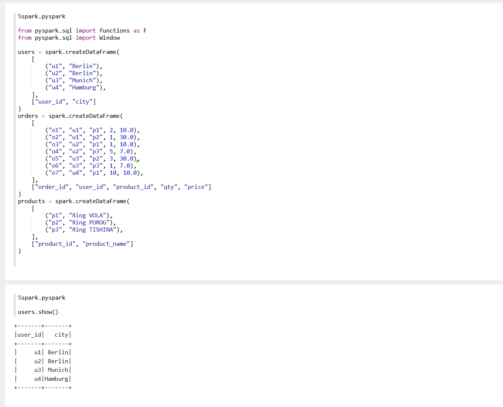
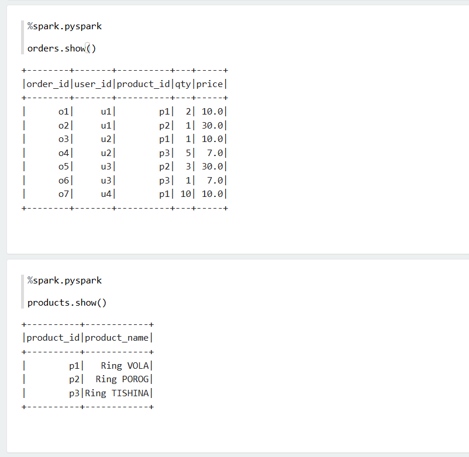
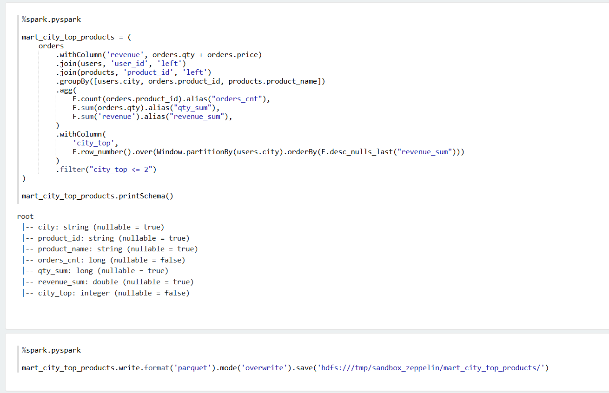
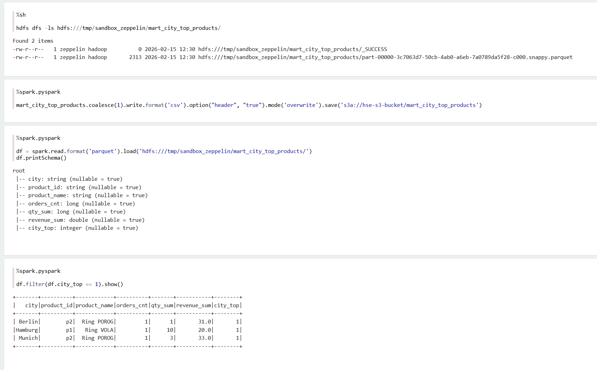

# Практика работы с облачным Hadoop
Для автоматизации развертывания необходимых ресурсов в Yandex Cloud был выбран подход IaC с использованием Terraform.
В папке terraform содержится скрипт для аутентификации и конфигурационный файл main.tf

После развертывания инфраструктуры с помощью terraform apply были выполнено задание по обработке данных в Spark.
Готовая витрина была выгружена в виде csv-файла s3.csv, скрипт обработки - vekasyan.ipynb

Далее приведен ход расчета витрины

### Создание датафреймов для обработки

### Создание трансформации и запись витрины в hdfs

### Запись витрины в s3 для выгрузки и чтение с hdfs

